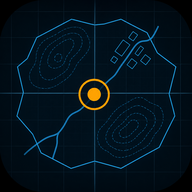

<p align="center">
  
</p>

<h1 align="center">Field Maps</h1>

<p align="center">
  <strong>Your position on the tactical map — offline, no signal needed.</strong><br>
  <a href="https://www.fieldmaps.app">www.fieldmaps.app</a>
</p>

Field Maps is an offline-first progressive web app for a single site: the former
military airfield at **Mahlwinkel, Saxony-Anhalt, Germany**. It uses the phone's GPS
to show where you are standing on the tactical map of the airsoft event you are
playing — every numbered building, safe zone, faction headquarters and play-area
boundary, drawn the way that event's printed Taktikkarte draws it.

There is no tile server and no backend. The map is a vector rendering of bundled
OpenStreetMap data, the georeferencing is a hardcoded calibration solved in the
browser, and every screen is reachable from the service worker cache. Once the app
has been opened on a network, it works with no signal at all — which is the point,
because the field has very little.

## What it does

- **Live position and heading.** GPS position with its accuracy circle, plus a
  heading arrow that points true even where the printed map is not north-aligned.
  Heading comes from GPS course while you move and the magnetometer while you stand
  still, because metal replicas deflect a compass.
- **Navigate to a point of interest.** Pick a building from the list, tap
  "Navigate here" in its popup, or double-tap its dot on the map.
- **One map per event.** Labels, zones, headquarters, frontlines and colours change
  per event; the ground underneath is the same airfield every time.
- **Layer toggles** for point-of-interest numbers, the grid, the out-of-bounds mask,
  zones and headquarters. Your choices persist.
- **Sticky grid axis** so the column letters and row numbers stay on screen while
  the map scrolls under them.
- **Both languages.** German and English, including the Impressum and privacy notice.

## Events covered

Six scenarios, ordered on the overview screen by how soon they start:

| Event                 | When           | Id    |
| --------------------- | -------------- | ----- |
| Dark Emergency        | 29 Apr – 2 May | `de`  |
| Lost Airfield         | 20 Jun         | `laf` |
| Mission 24            | 3 – 5 Jul      | `m24` |
| Airsoft Days          | 6 – 9 Aug      | `asd` |
| LIGHT-SIM             | 17 – 20 Sep    | `lso` |
| Operation Tschernobyl | 8 – 11 Oct     | `opt` |

Dates are stored as month and day only, because the events recur annually.

## Install it

Open [www.fieldmaps.app](https://www.fieldmaps.app) on your phone and add it to your
home screen — Share → "Add to Home Screen" on iPhone, ⋮ → "Install app" on Android.
It then runs full screen like a normal app, and it keeps itself up to date without
being asked.

## Run it locally

Node 22 (see `.node-version`).

```bash
npm install
npm run dev
```

Other commands:

| Command           | What it does                                                 |
| ----------------- | ------------------------------------------------------------ |
| `npm run build`   | Typecheck with `tsc --noEmit`, then `vite build` to `dist/`  |
| `npm test`        | Transform self-test against synthetic known truth            |
| `npm run preview` | Build, then serve it through `wrangler dev` as it deploys    |
| `npm run serve`   | Serve an existing `dist/` on port 4173, open to the network  |
| `npm run tunnel`  | Expose port 4173 over HTTPS, for testing GPS on a real phone |
| `npm run deploy`  | Build and `wrangler deploy` to Cloudflare                    |
| `npm run format`  | Prettier over the repository                                 |

Geolocation needs a secure context, so the app will not locate you from `file://`,
and neither will it over plain HTTP from another device. `npm run dev` binds to the
network, which is enough for layout work on a phone. For a real GPS test, build,
`npm run serve`, and put an HTTPS URL in front of it with `npm run tunnel`.

`dist/` can also be published over HTTPS on any static host, GitHub Pages included.
The one requirement a host has to honour is `public/_headers`, which serves `sw.js`
as `no-cache` — that single line is the whole self-update path.

## Refreshing the map data

The basemap comes from `public/map_osm.geojson`, downloaded once from the Overpass
API. To refresh it:

```bash
node scripts/fetch-osm.mjs
```

That is the only step in this project that touches the network at build time. The
script also prints the control points and canvas dimensions to paste into
`src/config.ts`.

## Stack

Vite, Lit and TypeScript, with Leaflet (`L.CRS.Simple`) for rendering and
`vite-plugin-pwa` (Workbox) for the offline service worker. Leaflet and Lit are the
only runtime dependencies, and staying that self-contained is deliberate.

The basemap is not a set of Leaflet vector layers. Geometry is projected to canvas
pixels once per map load and rasterized into canvas tiles, so panning moves finished
pixels instead of redrawing vectors. Only things that follow the user — the position
marker, the route, the labels — are Leaflet layers.

## Where the coordinates come from

Every point-of-interest coordinate, play area, zone and headquarters position was
read off the organiser's printed tactical maps in `reference/tactical-maps/`, by
fitting the same similarity transform the app uses and inverting it. Accuracy varies
by source: the buildings are good to a few metres, while the traced play areas and
zones are only good to a few tens of metres. The printed maps say as much — the real
boundary on the ground is marked with tape.

## Contributing

`AGENTS.md` is the working document for anyone changing the code, human or agent. It
covers the file map, the invariants that must not be broken, the calibration
workflow and the platform gotchas. Read it before touching the transform math, the
basemap or the service worker.

Adding an event usually means one new file in `src/scenarios/` plus a line in
`src/scenarios/index.ts`.

## Contact

Robert Wolffgang — <robert@wolffgang.de>. The Impressum and privacy notice live at
[fieldmaps.app/?page=impressum](https://www.fieldmaps.app/?page=impressum).
If the app is useful to you, there is a
[donation link](https://buymeacoffee.com/rwolffgang).
